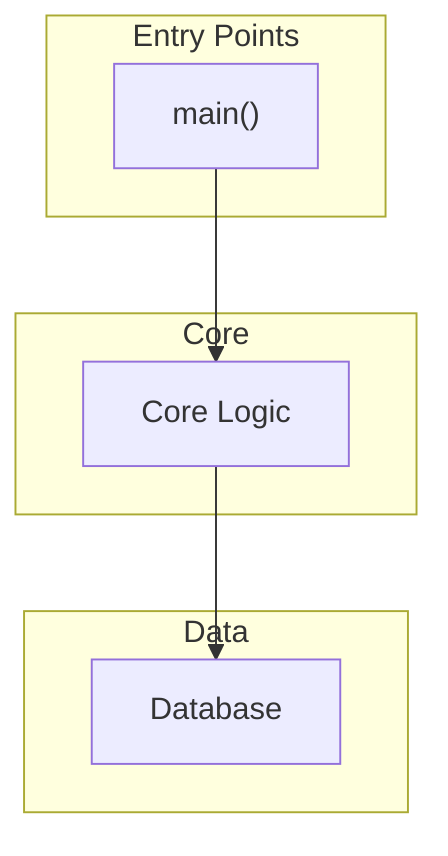

Refresh the architecture visualization for an indexed project.

## Steps

### 1. Detect project

- If `$ARGUMENTS` is provided: use it as the project path or name.
- If no arguments: use the current working directory.
- Resolve the project name (lowercase directory name).

### 2. Verify index exists

Call `codebase-memory-mcp_list_projects` to confirm the project is indexed. If not, suggest running `/cbm-init` first.

### 3. Get fresh architecture data

Call `codebase-memory-mcp_get_architecture` with:
- `project`: the project name
- `aspects`: `["all"]`

Also call:
- `codebase-memory-mcp_search_graph(project="<name>", label="Function", min_degree=5, limit=20)` — hotspots
- `graphify_god_nodes()` — most-connected nodes
- `graphify_graph_stats()` — graph statistics

### 4. Get graphify insights (if available)

If the project has a graphify graph:
- `graphify_query_graph(query="MATCH (n)-[r]->(m) RETURN n, type(r), m LIMIT 50")` — relationships
- `graphify_get_community()` — community structure

### 5. Regenerate Mermaid diagram

From fresh data, synthesize an updated Mermaid `graph TD`:

**Rules:**
- Max 30 nodes. Summarize low-degree nodes into cluster labels.
- Short labels (function name only).
- Subgraphs for packages/clusters.
- Highlight hotspots (red), entry points (blue), god nodes (orange).
- Cross-package edges with labels.

**Layout:**


### 6. Update docs/CODEBASE-INTELLIGENCE.md

Read the existing file. Replace only the Mermaid diagram block (between ` ```mermaid ` and ` ``` `) with the new diagram.

Update the status table if node/edge counts changed.

If the file doesn't exist, create it using the full template from `/cbm-init`.

### 7. Report

- Project name
- Graph stats: nodes, edges, packages, clusters
- God nodes: top 5 most connected
- Diagram: updated (node count, edge count)
- File: `docs/CODEBASE-INTELLIGENCE.md` updated

## Safety

- Read-only for source code. Write only `docs/CODEBASE-INTELLIGENCE.md`.
- Do not commit. Do not re-index (use `/cbm-init` for that).
